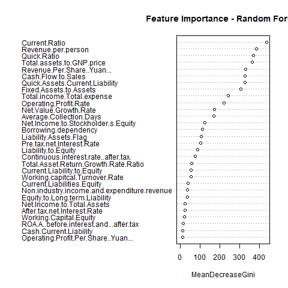

# Bankruptcy Prediction Project

# Project Overview
This project predicts company bankruptcy using financial ratios and other company-level features.  
We implemented **Logistic Regression** and **Random Forest** models to classify companies as bankrupt or non-bankrupt.  
Special attention was given to **class imbalance**, which was handled using **ROSE (Random Over-Sampling Examples)**.

---

##  Dataset
- **Train dataset:** `train.csv`  
- **Test dataset:** `test.csv`  
- **Balanced training dataset:** `train_balanced.csv` (created with ROSE)  

**Target variable:** `Bankrupt.`  
- `0` → Not bankrupt  
- `1` → Bankrupt  

**Predictor variables:** Financial ratios, margins, and company performance metrics.

---

## Project Workflow

1. Load and preprocess the data (convert `Bankrupt.` to factor, handle missing values).  
2. Handle class imbalance using **ROSE**.  
3. Train **Logistic Regression** and **Random Forest** models.  
4. Evaluate models using **confusion matrix**, **ROC curve**, and **AUC**.  
5. Analyze variable importance (Random Forest).  
6. Visualize results.

 

#HOW TO RUN

##  Installation / Requirements
R >= 4.2 and the following packages:

install.packages(c("randomForest", "ROSE", "caret", "pROC", "dplyr"))
# Load datasets
train <- read.csv("data/train.csv")
test <- read.csv("data/test.csv")

# Convert target to factor
train$Bankrupt. <- as.factor(train$Bankrupt.)
test$Bankrupt. <- as.factor(test$Bankrupt.)

# Balance training data using ROSE
library(ROSE)
train_balanced <- ROSE(Bankrupt. ~ ., data = train, N = nrow(train)*2)$data
train_balanced$Bankrupt. <- as.factor(train_balanced$Bankrupt.)

# Build Random Forest model
library(randomForest)
rf_model <- randomForest(Bankrupt. ~ ., data = train_balanced, ntree = 500)

# Predict probabilities
pred_prob_rf <- predict(rf_model, newdata = test, type = "prob")[,2]

# ROC and AUC
library(pROC)
roc_obj <- roc(test$Bankrupt., pred_prob_rf)
plot(roc_obj, col = "blue", main = "ROC Curve - Random Forest")
auc(roc_obj)

| Model               | AUC    | Accuracy | Sensitivity | Specificity | Balanced Accuracy |
| ------------------- | ------ | -------- | ----------- | ----------- | ----------------- |
| Logistic Regression | 0.9051 | 0.8533   | 0.8636      | 0.8529      | 0.8583            |
| Random Forest       | 0.8504 | 0.8321   | 0.82        | 0.85        | 0.835             |

importance_rf <- importance(rf_model)
varImpPlot(rf_model)

# Run the analysis script:

source("bankruptcy_prediction.R")

# Outputs:

ROC Curve saved as outputs/roc_curve.png

Variable Importance Plot saved as outputs/var_importance.png

# Notes & Recommendations

The dataset is highly imbalanced; ROSE sampling improves minority class detection.

Random Forest shows better generalization than Logistic Regression.

Future work: try SMOTE, XGBoost, or tuning thresholds for improved prediction of bankrupt companies.

# Author
Afsana Reza

BBA in Business Analytics, United International University
